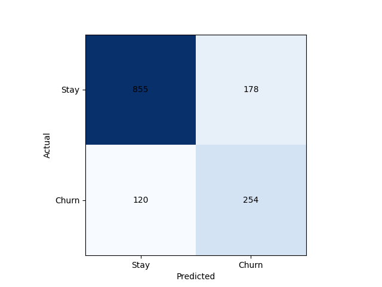
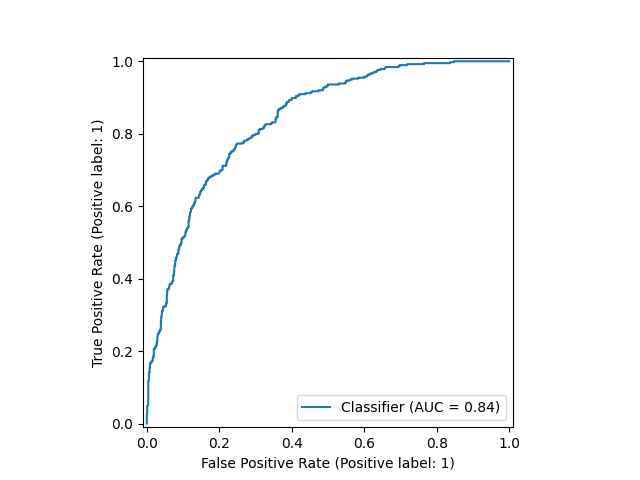

# Gradient Boosting Churn Model Report

**Test ROC AUC:** 0.8373  
**Test F1 (@thr=0.38):** 0.630

## Classification Report  
              precision    recall  f1-score   support

           0       0.88      0.83      0.85      1033
           1       0.59      0.68      0.63       374

    accuracy                           0.79      1407
   macro avg       0.73      0.75      0.74      1407
weighted avg       0.80      0.79      0.79      1407

scss
Copy
Edit

 
